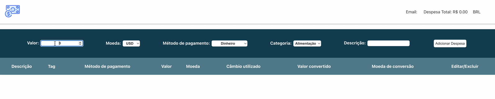

# Boas-vindas ao repositório do projeto Trybewallet!

<details>
  <summary><strong>👨‍💻 O que deverá ser desenvolvido</strong></summary><br />

  Neste projeto, você vai desenvolver uma carteira de controle de gastos com conversor de moedas. Ao utilizar essa aplicação, a pessoa usuária deverá ser capaz de:

  - Adicionar, remover e editar um gasto.
  - Visualizar sua tabela de gastos.
  - Visualizar o total de gastos convertidos para uma moeda de sua escolha.
</details>

<details>
  <summary><strong>:memo: Habilidades</strong></summary><br />

Neste projeto, verificamos se você é capaz de:

- Criar um _store_ Redux em aplicações React.

- Criar _reducers_ no Redux em aplicações React.

- Criar _actions_ no Redux em aplicações React.

- Criar _dispatchers_ no Redux em aplicações React.

- Usar os hooks do redux para manipulação e leitura do estado global..

- Criar _actions_ assíncronas na aplicação React que faz uso de Redux.
</details>

# Orientações

<details>
  <summary><strong>‼️ Antes de começar a desenvolver</strong></summary><br />

  1. Instale as dependências

  - `npm install`.
  
</details>

# Requisitos

:warning: **PULL REQUESTS COM ISSUES DE LINTER NÃO SERÃO AVALIADAS.** :warning:

:warning: Os GIFs são meramente ilustrativos para visualizar o fluxo da aplicação. Os nomes devem seguir os requisitos e não o GIF. :warning:

---

## Página de login

Crie uma página para que a pessoa usuária se identifique com e-mail e senha. Essa página deve ser a página inicial de seu aplicativo.

<details><summary> Página de login</summary>

  
</details><br />

## 1. Crie uma página inicial de login com os seguintes campos e características:

* A rota para esta página deve ser `/`.

* <details><summary> Você deve criar um local para que a pessoa usuária insira seu e-mail e sua senha:</summary>

  - O campo para o e-mail precisa ter o atributo `data-testid="email-input"`.
  - O e-mail precisa estar em um formato válido, como 'alguem@alguem.com'.
  - O campo para a senha precisa ter o atributo `data-testid="password-input"`.
  - A senha precisa ter 6 ou mais caracteres.
</details>

* <details><summary> Crie um botão com o texto <code>Entrar</code>:</summary>

  - O botão precisa estar **desabilitado** caso o e-mail não tenha um formato válido ou a senha possua um tamanho menor que 6 caracteres.

  - Salve o e-mail no estado global da aplicação com a chave **_e-mail_** assim que a pessoa usuária logar.

  - A rota deve ser mudada para `/carteira` após o clique no botão `**Entrar**`.
</details>

---

## Página da carteira

Crie uma página para que a pessoa usuária gerencie a carteira de gastos em diversas moedas. A página deve indicar a despesa total em real, que é representado pelo código BRL. Além disso, a página deve ser renderizada por um componente chamado **Wallet**.

- A rota para esta página deve ser `/carteira`.

<details><summary> Página da carteira:</summary>
  
  
</details><br />

---

## Header

## 2. Crie um header para a página de carteira com as seguintes características:

<details>
<summary>O componente `Header` deve ser renderizado dentro do componente [`Wallet`](#página-da-carteira)</summary><br />

* <details><summary> Um elemento que exiba o e-mail da pessoa usuária que fez login:</summary>

  - Adicione o atributo `data-testid="email-field"`.

  - :bulb: **Dica**: você deve pegar o e-mail do estado global da aplicação (no Redux).

* <details><summary> Um elemento com a despesa total gerada pela lista de gastos:</summary>

  - Adicione o atributo `data-testid="total-field"` neste elemento.

  - Inicialmente esse elemento deve exibir o valor `0`.

* <details><summary> Um elemento que mostre qual câmbio está sendo utilizado, o qual, nesse caso, será BRL:</summary>

  - Adicione o atributo `data-testid="header-currency-field"` nesse elemento.

</details>

---

## 3. Desenvolva um formulário para adicionar uma despesa contendo as seguintes características:

<details><summary>O componente `WalletForm` deve ser renderizado dentro do componente <a href="#página-da-carteira"><code>Wallet</code></a></summary><br />

  * <details><summary> Um campo para adicionar valor da despesa:</summary>

      - Adicione o atributo `data-testid="value-input"`.

  * <details><summary> Um campo para adicionar a descrição da despesa:</summary>

      - Adicione o atributo `data-testid="description-input"`.

  * <details><summary> Um campo para selecionar em qual moeda será registrada a despesa:</summary>

    - O campo deve ser um `<select>`.
    - Adicione o atributo `data-testid="currency-input"`.
    - As options devem ser preenchidas pelo valor da chave `currencies` do estado global.
      - Os valores da chave <code>currencies</code> no estado global devem ser puxados por meio de uma requisição à API no endpoint `https://economia.awesomeapi.com.br/json/all`.
      - Remova, das informações trazidas pela API, a opção 'USDT'.
      - A chave `currencies` do estado global deve ser um array.

  * <details><summary> Um campo para adicionar o método de pagamento utilizado:</summary>

    - Esse campo deve ser um `<select>`.
    - Adicione o atributo `data-testid="method-input"`.
    - A pessoa usuária deve poder escolher entre os campos: 'Dinheiro', 'Cartão de crédito' e 'Cartão de débito'.

  * <details><summary> Um campo para selecionar uma categoria (tag) para a despesa:</summary>

    - O campo deve ser um `<select>`.
    - Adicione o atributo `data-testid="tag-input"`.
    - Esse campo deve ser um dropdown. A pessoa usuária deve poder escolher entre os campos: 'Alimentação', 'Lazer', 'Trabalho', 'Transporte' e 'Saúde'.

  <br />
  <details>
    <summary><strong>Observações importantes:</strong></summary><br />

    Note que os campos `<select>` já iniciam com um valor selecionado em seu navegador. Você também pode verificar por meio do React Developer Tools se o estado de seu componente inicializa de modo sincronizado com o que é exibido no navegador.

    Para ilustrar, imagine que o estado inicial seja uma string vazia. Nesse caso, a pessoa usuária poderá facilmente causar um problema onde ela acredita que a opção já está selecionada (uma vez que o select mostra um valor), quando na verdade ela ainda não está (o estado foi inicializado com uma string vazia). Por esse motivo, é importante sincronizar o mesmo valor inicial do `<select>` em seu estado no React, em vez de inicializar com uma string vazia.

  <br />
  <details><summary> Ilustração do formulário</summary>

  
  </details><br />
</details>
</details>

<details><summary> Desenvolva a funcionalidade do botão `Adicionar despesa` de modo que, ao clicar no botão, as ações descritas a seguir sejam executadas.</summary>

  - Crie um botão com o texto `Adicionar despesa`. Ele servirá para salvar as informações da despesa no estado global e atualizar a soma de despesas no header.

  - <details><summary> Os valores dos campos devem ser salvos no estado da aplicação, na chave <b><i>expenses</i></b>, dentro de um array contendo todos gastos que serão adicionados:</summary>

    - O `id` da despesa **deve** ser um número sequencial que comece em 0. Assim, a primeira despesa terá id 0, a segunda terá id 1, a terceira terá id 2, e assim por diante.
    - :bulb: **Atenção**: você deverá fazer uma requisição para a API e buscar a cotação no momento em que o botão `Adicionar despesa` for apertado. Para isso, você poderá utilizar um thunk.
      - **Você deverá salvar a cotação do câmbio feita no momento da adição** para efetuar a edição do gasto (requisito 8). Caso você não tenha essa informação salva, o valor da cotação trazida poderá ser diferente do obtido anteriormente.

    </details>

  - <details><summary> Após adicionar a despesa:</summary>

    - Atualize a soma total das despesas (por meio da chave `ask`). Essa informação deve ficar no [`header`](#2-crie-uma-página-para-sua-carteira-com-as-seguintes-características), dentro do elemento com `data-testid="total-field"`.
      - O elemento com o testID deve conter apenas a soma total das despesas.
      - O valor total deverá ser exibido com duas casas decimais. Exemplo: (valor – ponto – duas casas decimais) `100.00` `23.50`

    - Limpe os inputs de valor e descrição.
    </details>

  - <details><summary> As despesas salvas no Redux ficarão com um formato semelhante ao seguinte:</summary>

      ```javascript
      expenses: [{
        "id": 0,
        "value": "3",
        "description": "Hot Dog",
        "currency": "USD",
        "method": "Dinheiro",
        "tag": "Alimentação",
        "exchangeRates": {
          "USD": {
            "code": "USD",
            "name": "Dólar Comercial",
            "ask": "5.6208",
            ...
          },
          "CAD": {
            "code": "CAD",
            "name": "Dólar Canadense",
            "ask": "4.2313",
            ...
          },
          "EUR": {
            "code": "EUR",
            "name": "Euro",
            "ask": "6.6112",
            ...
          },
          "GBP": {
            "code": "GBP",
            "name": "Libra Esterlina",
            "ask": "7.2498",
            ...
          },
          "ARS": {
            "code": "ARS",
            "name": "Peso Argentino",
            "ask": "0.0729",
            ...
          },
          "BTC": {
            "code": "BTC",
            "name": "Bitcoin",
            "ask": "60299",
            ...
          },
          "LTC": {
            "code": "LTC",
            "name": "Litecoin",
            "ask": "261.69",
            ...
          },
          "JPY": {
            "code": "JPY",
            "name": "Iene Japonês",
            "ask": "0.05301",
            ...
          },
          "CHF": {
            "code": "CHF",
            "name": "Franco Suíço",
            "ask": "6.1297",
            ...
          },
          "AUD": {
            "code": "AUD",
            "name": "Dólar Australiano",
            "ask": "4.0124",
            ...
          },
          "CNY": {
            "code": "CNY",
            "name": "Yuan Chinês",
            "ask": "0.8278",
            ...
          },
          "ILS": {
            "code": "ILS",
            "name": "Novo Shekel Israelense",
            "ask": "1.6514",
            ...
          },
          "ETH": {
            "code": "ETH",
            "name": "Ethereum",
            "ask": "5184",
            ...
          },
          "XRP": {
            "code": "XRP",
            "name": "Ripple",
            "ask": "1.4",
            ...
          }
        }
      }]
      ```
    </details>
</details><br />

---

## 4. Desenvolva testes para atingir 60% de cobertura total da aplicação:

<details>
<summary><strong>Observações técnicas</strong></summary><br />

  * Os testes criados por você não irão influenciar os outros requisitos no avaliador. Você deverá desenvolver os testes unitários e de integração usando a biblioteca React Testing Library, enquanto o avaliador usará a biblioteca [Cypress](https://docs.cypress.io/) para avaliar os requisitos, inclusive os de cobertura.
  * Em caso de dúvidas, leia a seção <a href="#testes">Testes > Execução de teste de cobertura</a>.

</details>

---

## Tabela de gastos

## 5. Desenvolva uma tabela de gastos contendo as seguintes características:

<details><summary> A tabela deve ter um cabeçalho com os seguintes valores:</summary>
  O componente `Table` deve ser renderizado dentro do componente [`Wallet`](#página-da-carteira).

    - Descrição;
    - Tag;
    - Método de pagamento;
    - Valor;
    - Moeda;
    - Câmbio utilizado;
    - Valor convertido;
    - Moeda de conversão;
    - Editar/Excluir.
</details><br />

<details><summary> A tabela deve ser alimentada pelo estado da aplicação, que estará disponível na chave <b><i>expenses</i></b>, que vem do <i>reducer</i> <code>wallet</code>:</summary>.

  - O campo de `Moeda` deverá conter o nome da moeda. Portanto, em vez de conter 'USD' ou 'EUR', o campo deve apresentar "Dólar Americano/Real Brasileiro" e "Euro/Real Brasileiro", respectivamente.

  - O elemento que exibe a `Moeda de conversão` deverá ser sempre 'Real'.

  - Como a tabela apresenta valores contábeis, eles devem ter duas casas após o ponto. Arredonde sua resposta somente na hora de renderizar o resultado e, para os cálculos, utilize sempre os valores vindos da API (utilize o campo `ask` que vem da API).

  - Utilize sempre o formato `0.00` (número – ponto – duas casas decimais).
</details><br />

---

## 6. Crie um botão para deletar uma despesa da tabela contendo as seguintes características:

<details><summary> Ilustração do botão</summary>

  
</details>

* O botão deve ser o último item da linha da tabela e deve ter o atributo `data-testid="delete-btn"`.

* Após o botão ser clicado, as seguintes ações deverão ocorrer:
  * A despesa deverá ser deletada do estado global.
  * A despesa deixará de ser exibida na tabela.
  * O valor total exibido no header será alterado.

---

# Requisitos Bônus

## 7. Crie um botão para editar uma despesa da tabela contendo as seguintes características:

<details><summary> Ilustração do botão</summary>

  
</details>

* O botão deve estar dentro do último item da linha da tabela e deve ter `data-testid="edit-btn"`.

* <details><summary> Ao ser clicado, o botão habilita um formulário para editar a linha da tabela. Ao clicar em "Editar despesa", ela é atualizada, alterando o estado global.</summary>

  - O formulário deverá ter os mesmos `data-testid` do formulário de adicionar despesa. Assim, você pode reaproveitá-lo.

  - O botão para submeter a despesa para edição deverá conter **exatamente** o texto `Editar despesa`.

  - Após a edição da despesa, a ordem das despesas na tabela precisa ser mantida.

  - :bulb: **Observação**: para esse requisito, não é necessário popular os inputs com os valores prévios da despesa. A imagem do GIF é apenas uma sugestão. 

  - :bulb: Lembre-se de utilizar o formato do estado global da aplicação informado na seção <a href="#como-desenvolver">Desenvolvimento</a>.

  - **Atenção**: o câmbio utilizado na edição deve ser o mesmo do cálculo feito na adição do gasto.
</details><br />

## 8. Desenvolva testes para atingir 90% de cobertura total da aplicação:

<details>
<summary><strong>Observações técnicas</strong></summary><br />

  * Os testes criados por você não irão influenciar os outros requisitos no avaliador. Você deverá desenvolver os testes unitários e de integração usando a biblioteca React Testing Library, enquanto o avaliador usará a biblioteca [Cypress](https://docs.cypress.io/) para avaliar os requisitos, inclusive os de cobertura.
  * Em caso de dúvidas, leia a seção <a href="#testes">Testes > Execução de teste de cobertura</a>.

</details>
